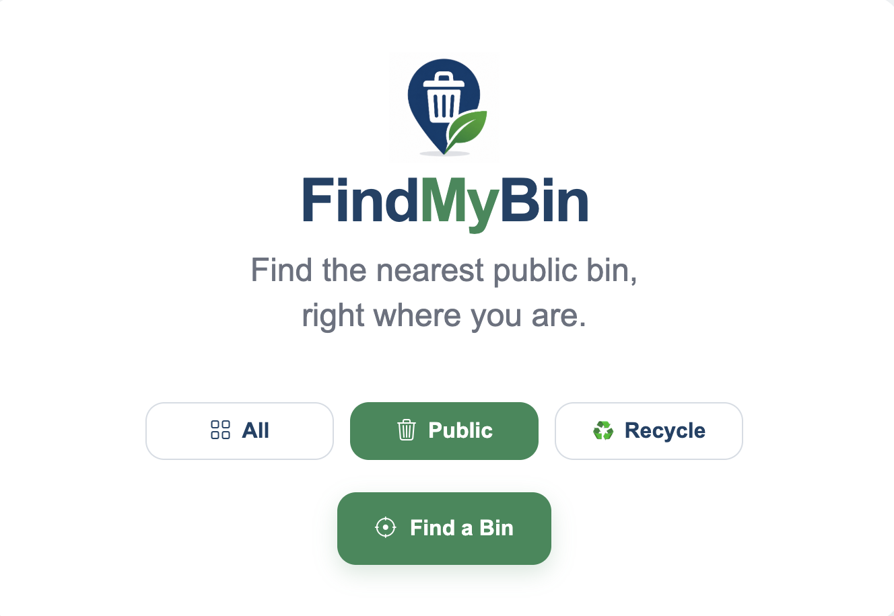
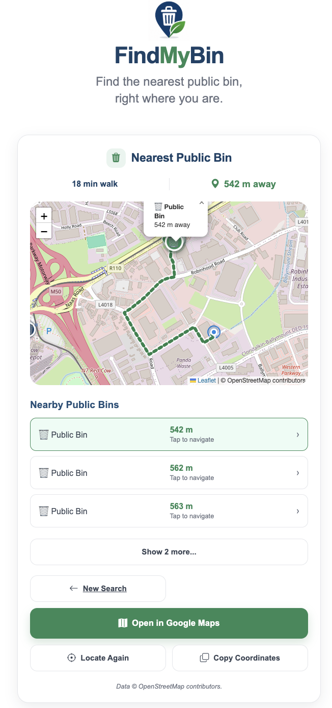

# 🗑️ FindMyBin

FindMyBin is a responsive web application that helps users locate the nearest public and recycling bins using their current location.

The application provides walking directions, an interactive map, nearby bin locations and one-tap navigation with Google Maps.

**🌐 Live Demo:** https://findmybin.app

---

## Features

- 🗑️ Find the nearest public bin
- ♻️ Find the nearest recycling bin
- 🌍 Search all supported bin types
- 🗺️ Interactive Leaflet map
- 🚶 Walking route and estimated walking time
- 📍 Straight-line distance calculation
- 📋 Nearby bins list
- 📱 Responsive mobile-first interface
- 📍 Open destination in Google Maps
- 📋 Copy bin coordinates
- 🔄 Locate Again without reloading the page
- ⚡ Progressive Web App (PWA)
- ☁️ Automatic deployment to Google Cloud Run

---

## Technologies

- Python
- Flask
- JavaScript (ES6)
- HTML5
- CSS3
- Leaflet
- OpenStreetMap
- OpenRouteService API
- Google Cloud Run
- Google Cloud Build
- GitHub

---

## Screenshots

### Home Screen



### Results Screen



---

## How it Works

1. Select a bin type.
2. Allow location access.
3. FindMyBin searches nearby OpenStreetMap data.
4. The nearest matching bin is displayed.
5. Walking directions and nearby alternatives are shown.
6. Navigate using Google Maps if required.

---

## Running Locally

Clone the repository

```bash
git clone https://github.com/Th3ThirdMan/nearest-bin.git
```

Move into the project

```bash
cd nearest-bin
```

Create a virtual environment

```bash
python -m venv venv
```

Activate it

### Windows

```bash
venv\Scripts\activate
```

### macOS / Linux

```bash
source venv/bin/activate
```

Install dependencies

```bash
pip install -r requirements.txt
```

Run the application

```bash
python app.py
```

Visit

```
http://127.0.0.1:5000
```

---

## Deployment

The application is automatically deployed using:

GitHub → Cloud Build → Google Cloud Run

Every push to the `main` branch triggers a new deployment.

---

## Roadmap

### v1.2

- Glass recycling banks
- Clothing banks
- Battery recycling
- User submitted bins
- Improved OpenStreetMap coverage

---

## Release History

### v1.1.0

- Added Public, Recycling and All filters
- Interactive map
- Walking directions
- Nearby bins list
- Google Maps navigation
- Mobile UI improvements
- Improved marker labels
- Various bug fixes

---

## Data Sources

- OpenStreetMap contributors
- OpenRouteService

---

## Author

David Kennedy

GitHub:
https://github.com/Th3ThirdMan

---

## License

This project is licensed under the MIT License.
